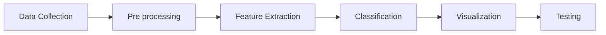

# Paper Review 

## Sentimental Analysis Using Supervised Learning Algorithms 

The [paper](https://ieeexplore.ieee.org/stamp/stamp.jsp?tp=&arnumber=9990320) summarizes the approaches to the Sentimental Analysis Task in the literature.
The steps usually followed are

The models mentioned for the `classification` tasks are:
- **Support Vector Machine**
- **Neural Network**
    1. Convolutional neural network-
    Convolutional neural networks are generally used for problems like digital image processing. For example- Hand digit recognition system, Vehicle detection system, Plant disease detection system.
    2. Artificial neural network-
    An artificial neural network is related to models where the classification is based on past data and also prediction. For example- Stock value prediction.
- **Decision Trees**
- **Naive Bayes**. Naive Bayes algorithm uses the concept of probability at the token level in order to calculate and efficiently classify data as a positive or a negative sentiment.
- **Maximum Cross entropy**.
This algorithm also supports a probabilistic approach like the Naive Bayes algorithm. The main difference is to maintain a set of user extracted features designed and accordingly weights are calculated by the model. 
- **K-NN**.
K-NN works similarly to Naive Bayes algorithm. The main difference lies on the basis of selecting the feature to be chosen as K-NN uses the cosine or the Euclidean distance in order to calculate the nearest neighbor for any node K

With the different supervised algorithms being discussed namely SVM, Neural Network, Decision Trees (DT), Naive Bayes, Maximum Cross entropy, K-NN the DT algorithm provides maximum accuracy and efficiency with highest precision of almost 90% approximately.

## Sentiment analysis using deep learning architectures: a review
The [paper](https://www.semanticscholar.org/paper/Sentiment-analysis-using-deep-learning-a-review-Yadav-Vishwakarma/b1e25e6dcf66029952b4f925c81848c04c97f2b6) reviews different methodologies applied to the task of Sentimental Analysis making use of deep learning.

It starts discussing the taxonomy of SA. 
- **Document Level**: Yang et al. (2016) proposed a hierarchical attention network model that focuses on vital content for constructing the doc- ument representation. SR-LSTM in which the first layer used LSTM to learn the sentence vectors, and second layer encodes the relations between the sentences. A hybrid approach of RBM and Probabilistic Neural Network (PNN) is proposed by Ghosh et al. (2017) in which RBM is used for dimen- sionality reduction, and PNN performs sentiment classification. The proposed approach gave better results on the five datasets compared to the state-of-the-art methods.
- **Sentence-level sentiment classification**: 
Zhao et al. (2017) propose CNN for constructing WDE-CNN and LSTM for constructing WDE-LSTM to extract feature vectors from review sentences. The model was evaluated on Amazon dataset from three domains: digital cameras, cell phones, and laptops. The accuracy obtained on WDE-CNN model was 87.7%, and on WDE-LSTM model was 87.9%, which shows that deep learning models gives highest accuracy as compared to baseline models. Xiong et al. (2018b) developed a model called Multi-level Sentiment-enriched Word Embedding (MSWE), which uses a Multi-layer perceptron (MLP) to model word-level sentiment information and CNN to model tweet- level sentiment information. The model also learns sentiment-specific word embeddings, and SVM is used for sentiment classification. It was evaluated on SemEval2013 dataset and Context-Sensitive Twitter (CST) dataset, which are the benchmark datasets for sentiment classification task. *

For sentence-level sentiment classification and aspect-level sentiment classification, researchers have majorly focused on RNN (particularly LSTM).

*Coupling LSTM and CNN has been provn to be a good idea as CNN can extract the local features in the text, and LSTM can capture the long-term dependencies in sentences.

Attention-based GRU networks are also applied to various sentiment analysis tasks like target based sentiment classification. Zhang et al. (2018b) proposed an approach to model target sentiment classification into Q&A system using Dynamic Memory Networks (DMN).

### **Datasets**
Twitter dataset (You et al. 2016) consists of 220,000 tweets that contain both images and text. Similarly, Tree LSTM with Attention has given the highest accuracy on this dataset.

## GRUBERT: A GRU-Based Method to Fuse BERT Hidden Layers for Twitter Sentiment Analysis

It proposes GRUBERT that learns to map the different BERT hidden layers to fused embeddings.

The issue it tries to solve is the inability of state of the art embedding to deal with abbreviations, misspellings, and hashtags not present in the dictionary.
BERT, which leveraged bi-directional transformers for lan- guage representations, for Twitter sentiment analysis is that it uses sub-tokens instead of a fixed per-word token. This makes it highly suitable for the Twitter dataset that often includes misspellings and slang words. In BERT the middle layers tend to capture syntactic information and later layers more semantic features

### Preprocessing
 To make the datasets conform more to the type of text the embeddings were trained on, the datasets undergo various preprocessing steps, such as removing duplicate tweets, excessive whitespaces, and replacing <user> and <url> with xxuser and xxurl, respectively. The authors also use pyspellchecker to correct misspelled words in each tweet.

 ### Architecture
 The article proposes an architecture for Twitter sentiment analysis using BERT and gated recurrent units (GRUs). Instead of using a linear combination of BERT's hidden layers, the authors opt to learn the combination using GRUs to better capture the information flow from low to high-level features. The authors also group different layers together using multiple bi-GRUs[^1] to find the best balance between incorporating information across layers and the capacity of a single bi-GRU. The tweet is tokenized using BERT's tokenizer, then run through the BERT-base-uncased model, which outputs 12 hidden layers. The intermediate group embeddings are obtained using variable numbers of bi-GRUs, and a further downstream bi-GRU is run on the obtained embeddings. The output is then fed into a fully connected layer for classification using a cross-entropy loss.

###  Specifics
- Groups of embeddings is runed
- Overfitting is prevented with early stopping and majority voting. 
- Weight sharing:  weight sharing can prevent overfitting to some extent (less degree of freedome), also different groups of BERT hidden layers contain some of the same information. Indeed, the transformer architecture has skip connections, so some information from previous layers is passed onto the next layer. 

[^1]: A bi-GRU (bidirectional gated recurrent unit) is a type of recurrent neural network (RNN) that processes input sequences in both forward and backward directions using gated units. The forward and backward processing results are concatenated to obtain a representation that takes into account the entire sequence. The use of bidirectional processing is beneficial for capturing long-term dependencies in the input sequence. In the context of the article, the authors use bi-GRUs to combine multiple hidden layers of BERT and capture the information flow from low to high-level features better.

